# Pourquoi ce document ?

J'ai créé ce document pour montrer qu'il est possible de travailler sur une machine Debian à l'IUT, de modifier son travail depuis sa session Windows à l'IUT et de continuer à travailler depuis son ordi chez soit.

## Rappel sur le stockage des machines physiques
Les machines physiques sont montées avec un dual-boot Debian/Windows en réseau. 

Les sessions Debian sont synchronisées entre les machines physiques via leur `/home/etudiants`.
*Si un étudiant télécharge ou modifie des fichiers dans son home : les changements seront visibles sur toutes autres sessions Debian à l'IUT connectées avec les mêmes identifiants.*

**L'état des sessions Windows n'est pas conservé entre les machines physiques, les modifications sont appliquées sur la machine physique sur laquelle la session Windows était ouverte**. Les dossiers de votre session (*Documents*, *Téléchargements*...) sont accessibles uniquement sur la machine physique sur laquelle votre session était ouverte.

Pour éditer et retrouver des fichiers de votre session Debian ou autre, un lecteur réseau est attaché. Celui-ci pointe à l'emplacement sur lequel votre session Debian est stockée.

Résumé : **sur les sessions Windows, un disque réseau est attaché contenant les fichiers de votre session Debian; vous pouvez l'utiliser pour stocker et modifier vos fichiers & les retrouver peu importe votre session, Windows ou Debian, même à l'extérieur de l'IUT**

Modification : pour l'année 2022-2023, le serveur distant de stockage était `mdm-stock` sur `10.2.12.20`, pour l'année 2023-2024 c'est `etudhomes` sur `10.2.12.6`.

## Accéder à vos fichiers à distance

Vos sessions peuvent partager les mêmes fichiers, mais vous pouvez aussi y accéder depuis chez vous.

Pour cela, le VPN de l'IUT permet entre autres de se connecter à distance au serveur de stockage de votre session.

### Sur Windows

<!-- Téléchargez le [fichier de configuration OpenVPN de l'IUT](https://vpn.univ-pau.fr/uppa_etudiant_v1.ovpn). -->

1. Téléchargez le [fichier de configuration OpenVPN de l'IUT](https://vpn.univ-pau.fr/uppa_etudiant_v2.ovpn).

2. Installez [OpenVPN](https://openvpn.net/community-downloads/).

3. Lancez OpenVPN, il apparaitra dans la zone des applications actives (flèche qui pointe vers le haut `^` dans la barre des taches).

4. *Clique droit dessus -> Importer* le fichier de configuration de l'IUT, puis *Connexion*. Les identifiants sont ceux universitaires. <br> Si réouverture : *Clique droit -> Connection*

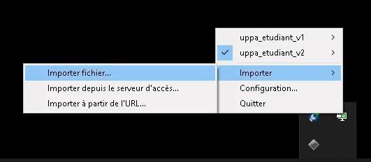
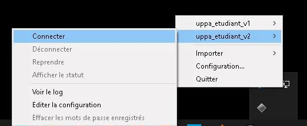
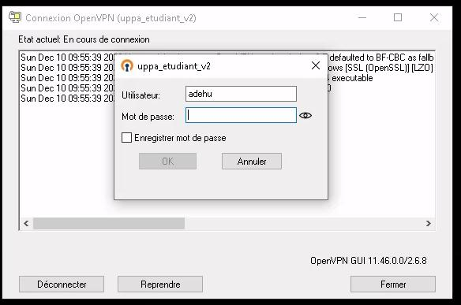

5. Dernière étape, aller dans votre explorateur de fichiers, & renseignez dans la barre d'adresses `\\etudhomes`. <br>
Nom d'utilisateur : identifiant_univ-pau_court@uppa.univ-pau.fr

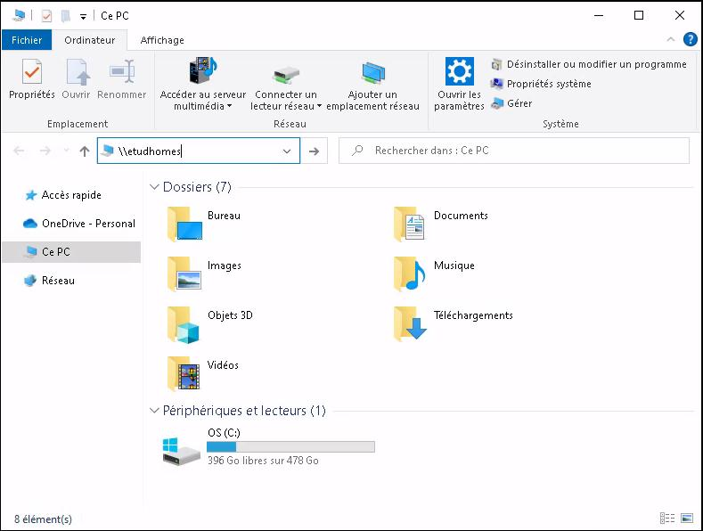
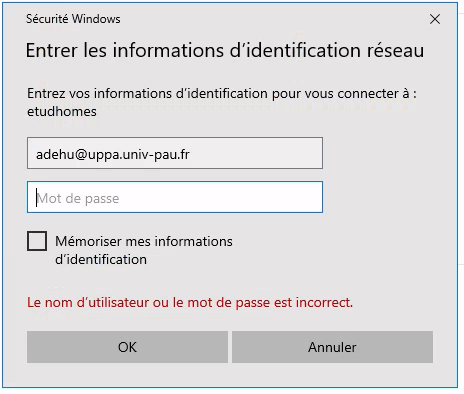
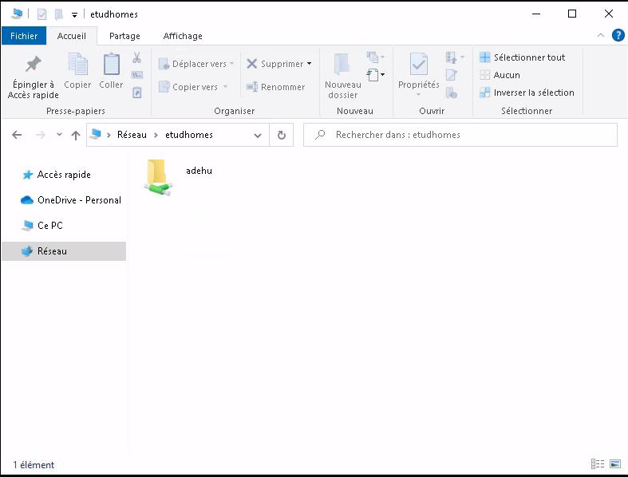

### Sur GNU/Linux (ex. Ubuntu)

L'environnement de bureau sera Gnome, le principe reste le même pour les autres.

1. Installation de OpenVPN :

```bash
sudo apt install -y openvpn
```

2. Téléchargement du [fichier de configuration OpenVPN de l'IUT](https://vpn.univ-pau.fr/uppa_etudiant_v2.ovpn) :

```bash
wget https://vpn.univ-pau.fr/uppa_etudiant_v2.ovpn
```

3. Lancement du fichier OpenVPN (identifiants univ-pau)

```bash
sudo openvpn uppa_etudiant_v2.ovpn &
```

4. Montage du répertoire distant depuis l'explorateur de fichier Nautilus

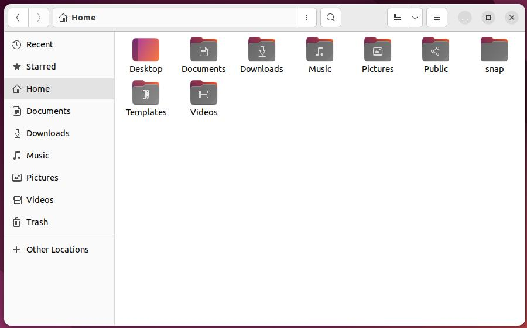
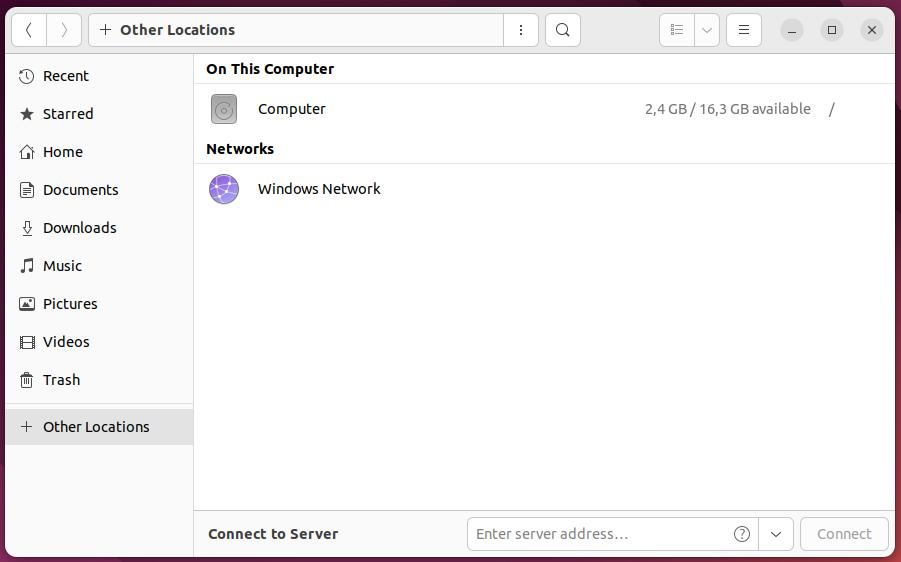
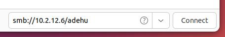
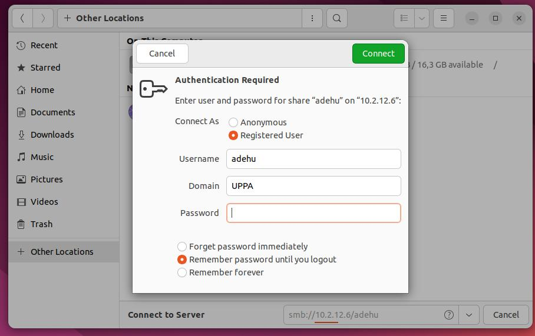
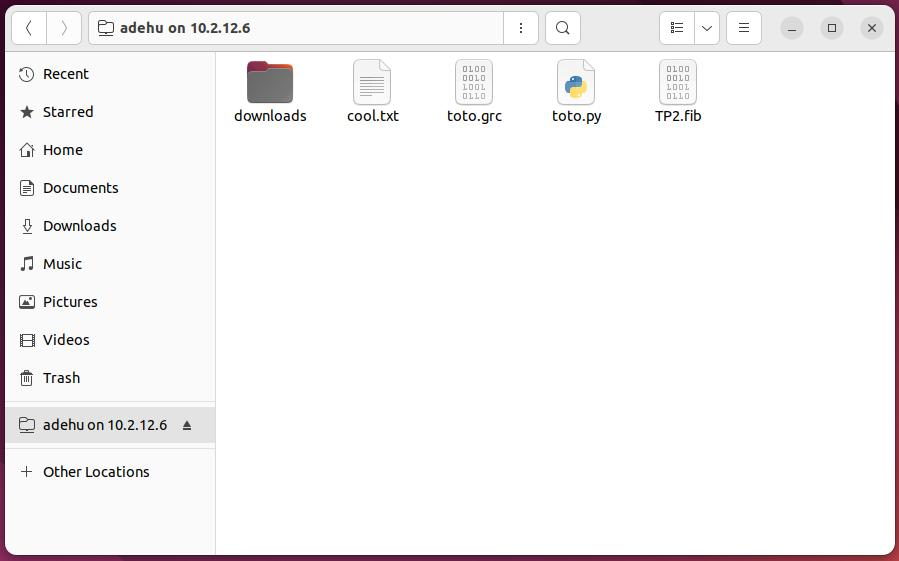